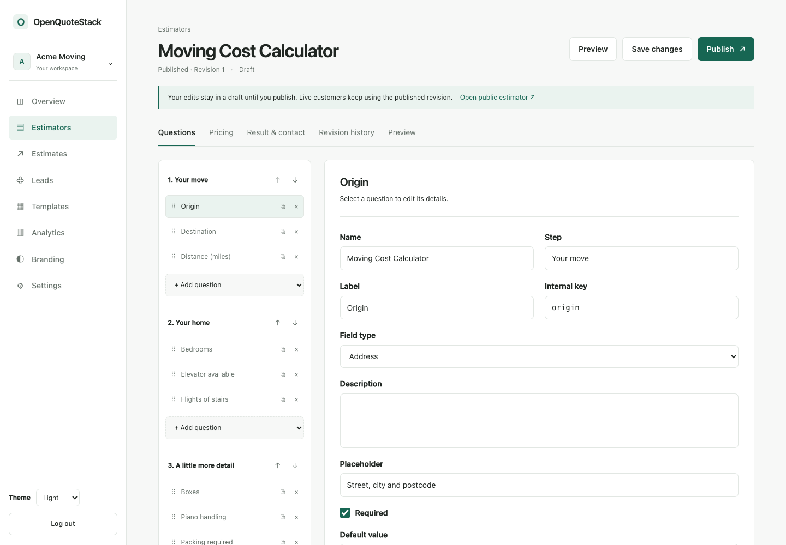

# OpenQuoteStack

The open-source stack for branded instant quotes and pricing estimators.

Build interactive pricing calculators, publish them under your own brand, embed
them on your website, and keep control of your customer data. OpenQuoteStack is
self-hosted software for service businesses, agencies and developers; basic
operation needs PostgreSQL and no proprietary cloud service.



**0.2.0-alpha.1** is an early public preview. Core authoring, customer quoting and
developer integrations work; account recovery, invitations and data-erasure
workflows are still planned. Read the [limitations](#current-limitations) before
accepting production customer data.

## Quick start

```sh
git clone https://github.com/ReVG08/OpenQuoteStack.git
cd OpenQuoteStack
cp .env.example .env
# Replace the PostgreSQL password, authentication secret and encryption key.
# Use independent random hex values; match the password in DATABASE_URL.
docker compose up -d --build
```

Open `http://localhost:3000`, create an account and organization, select a template,
customize questions/prices, preview and publish. Completed customer quotes appear
under Estimates with their original revision and calculation breakdown. No default
account or password is installed. PostgreSQL and brand images persist in named
volumes; a separate worker delivers integrations.

Use [Docker installation](docs/deployment/docker.md) for credentials, alternate
ports, TLS, health checks and upgrades. Public deployments require an HTTPS origin.
[Linux/Caddy/Nginx](docs/deployment/linux.md) and hosting-panel recipes are documented.

## Product

- Visual multi-step authoring with pointer/keyboard sorting, validation and AND/OR visibility.
- Fixed, per-unit, conditional, tiered and percentage pricing; minimums, maximums,
  ranges, weekday adjustments and advanced safe formulas.
- Exact monetary arithmetic and ordered, itemized explanations.
- Editable drafts, immutable publication snapshots and explicit rollback.
- Branded mobile calculators with progress and configurable contact capture.
- Estimates, statuses, internal notes, editable contacts and first-party conversion reports.
- Normalized logos/favicons, live branding preview and professional estimate PDFs.
- English/Brazilian Portuguese core product copy; light/dark/system admin appearance.
- Email/password accounts, database sessions, organization permissions and tenant isolation.

Three portable examples demonstrate different pricing patterns:

| Template                                                        | Demonstrates                                                        |
| --------------------------------------------------------------- | ------------------------------------------------------------------- |
| [Moving company](templates/moving-company.oqs.json)             | Bedrooms/distance, stairs, piano, weekend surcharge and minimum     |
| [Residential cleaning](templates/residential-cleaning.oqs.json) | Rooms/size, recurring discount, deep cleaning and add-ons           |
| [Web design / agency](templates/web-design-agency.oqs.json)     | Package choices, pages, optional functionality, rush fee and ranges |

Example prices and measurement units need review before publication. Template
currency selection preserves example major-unit values without exchange conversion.
Validated `.oqs.json` imports create a new identity; exports contain declarative
configuration without leads or credentials. See the [product workflow](docs/concepts/product-workflow.md)
and [template authoring guide](docs/concepts/templates.md).

## Developer platform

The [REST API v1](docs/api/rest.md) exposes tenant-scoped estimator, estimate and lead
resources. Owners/admins create hashed, scoped keys and revoke them in Settings.
Submissions calculate on the server, retain their published revision and support
transactional idempotency. Responses use stable representations, pagination and request IDs.

```ts
import { OpenQuoteStack } from "@openquotestack/sdk";
const oqs = new OpenQuoteStack({
  baseUrl: "https://quotes.example.com",
  apiKey: process.env.OPENQUOTESTACK_API_KEY!,
});
const page = await oqs.estimators.list();
```

[Signed webhooks](docs/platform/webhooks.md) use timestamped HMAC, durable delivery
records and bounded retries. PostgreSQL jobs handle delivery outside customer
requests; Redis is not required. Optional [SMTP](docs/platform/storage-and-email.md)
sends branded notifications, confirmations and estimates.

[Embedding](docs/platform/embedding.md) supports iframes and a small JavaScript
loader with automatic height and explicit framing permissions. [Custom domains](docs/platform/domains.md)
use tenant DNS verification; operators configure routing and TLS. Brand assets use
local storage by default or an [S3-compatible adapter](docs/platform/storage-and-email.md).
Audit records and authenticated system status help operators inspect changes.

## Engine and Schema

```ts
import { parseEstimator } from "@openquotestack/schema";
import { calculateEstimate } from "@openquotestack/engine";
const estimator = parseEstimator(document);
const result = calculateEstimate(estimator, answers);
// result.totalMinor, lineItems, adjustments, range, metadata
```

The engine depends only on Schema. It has no React, database, authentication,
network, browser, implicit clock or locale dependency. Prices use integer minor
units with exact rational intermediates and explicit currency exponents. Formatting
belongs to the caller. Formulas use a controlled AST, never arbitrary JavaScript.

[Engine](packages/engine/README.md), [Schema](packages/schema/README.md) and
[SDK](packages/sdk/README.md) are ESM packages with TypeScript declarations, prepared
for publication. They are not published externally as part of repository preparation.
Small working examples live under [examples](examples/).

## Local development

Use Node.js 24, pnpm 10.34.6 and PostgreSQL 18.

```sh
corepack enable
corepack prepare pnpm@10.34.6 --activate
pnpm install --frozen-lockfile
pnpm setup:env
# Start PostgreSQL in another terminal: pnpm db:local
# Or: docker compose up -d db
pnpm db:migrate
pnpm dev
```

The environment helper refuses to overwrite existing configuration. Match
`DATABASE_URL` to your database. `pnpm db:local` is development-only and retains a
loopback cluster under ignored `.local/postgres`. For port 3001, set
`BETTER_AUTH_URL=http://localhost:3001`, generate/build packages, then run
`pnpm --filter @openquotestack/web dev --port 3001`. Restart after environment changes.
Run `pnpm worker` separately for local background delivery.
After `pnpm build`, `pnpm --filter @openquotestack/web start` runs the standalone
server with copied public/static assets; `--port 3001` selects an alternate port.

Optional demo seeding needs an existing registered account. Set `SEED_OWNER_EMAIL`
and run `SEED_DEMO=1 pnpm db:seed`. It creates a separate fictional Acme Moving
workspace with three estimators and sample activity, preserving existing seeded data.
The public `/demo` playground is browser-only; published calculators save quotes.

```sh
pnpm templates:validate
pnpm example
pnpm test
pnpm test:database
pnpm typecheck
pnpm lint
pnpm format:check
pnpm build
```

Integration tests require a disposable database ending in `_test` and truncate
fixtures. Never use retained or production credentials. See [verification](docs/development/testing.md).

## Architecture and operations

| Location            | Responsibility                                                       |
| ------------------- | -------------------------------------------------------------------- |
| `apps/web`          | Next.js UI, HTTP, authentication and public rendering                |
| `packages/schema`   | Portable definitions and runtime validation                          |
| `packages/engine`   | Deterministic pricing and explanations                               |
| `packages/sdk`      | Typed API client, local facade and webhook verification              |
| `packages/database` | Prisma migrations, authorized transactions, outbox/jobs and adapters |
| `packages/core`     | Permissions, events and shared domain utilities                      |
| `packages/ui`       | Components and theme tokens                                          |
| `packages/config`   | Strict TypeScript configuration                                      |

Read the [architecture](docs/architecture/overview.md), [domain model](docs/architecture/domain-model.md)
and [ADRs](docs/adr/README.md). The [documentation index](docs/README.md) covers
installation, configuration, pricing, integrations, security and contribution.
Back up [PostgreSQL, assets and encryption secrets](docs/deployment/maintenance.md).
No hidden application telemetry or required third-party analytics is included;
see [privacy and data flows](docs/security/privacy.md).

## Current limitations

Account verification/password recovery, invitations and team administration are
not implemented. Recent-record administrative lists are bounded; broad search and
pagination are planned. Customer-data retention/erasure needs an explicit workflow.
This release has no zero-downtime upgrade guarantee or independent security certification.
Hosting-panel recipes and broader object-storage provider compatibility need further
testing. Mapping, customer uploads, payments, booking and CRM are outside current scope.

## Contributing and license

See [CONTRIBUTING.md](CONTRIBUTING.md), [ROADMAP.md](ROADMAP.md),
[CHANGELOG.md](CHANGELOG.md) and [SECURITY.md](SECURITY.md).

[GNU Affero General Public License v3.0 only](LICENSE), SPDX `AGPL-3.0-only`.
Commercial use and white labeling are permitted under the license. Modified
network-served versions carry corresponding-source obligations. Public packages
use the same license; review compatibility before embedding them in proprietary
software. See [ADR-0011](docs/adr/0011-open-source-license.md).
