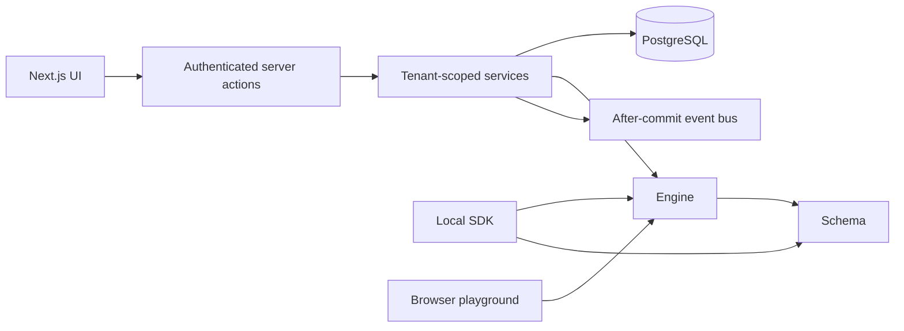

# Architecture

OpenQuoteStack is a modular monolith. The Next.js application handles HTTP,
sessions and UI; server-only services enforce permissions and orchestrate database
transactions. Public packages can be used separately from the application.

The engine consumes validated definitions and answers. It returns JSON-compatible
traces and totals. It performs no formatting, storage, authorization or I/O. Schema
validation checks document structure and references; answer validation belongs to
the engine because field visibility affects required inputs.

Database services receive actor identifiers from a verified session. Every resource
operation also receives organization ownership and checks both membership and
resource ownership inside a serializable transaction. Caller-supplied organization
IDs are selectors, not credentials. UI permissions are presentation only.

The application stores a persistent estimator identity and append-only revisions.
Publication switches a pointer to one revision. An estimate stores effective answers,
the complete result, engine version and revision identifier. Composite foreign keys
prevent cross-tenant revision, publication, estimate and lead references.

Internal events are published after transaction commit. Subscribers are in-process
and best-effort. Audit entries commit with the underlying write. Delivery across
process failures is not guaranteed; external integrations will need durable delivery.

There is no public quote endpoint yet. Browser preview calculations are untrusted;
saved estimates are recalculated on the server using the currently published
revision. The returned server result is the result shown after saving.

Organization locale, timezone and currency are separate fields. Estimator currency
and minor-unit exponent are explicit and preserved in each revision; organization
currency does not rewrite an imported template. Browser formatting uses the selected
locale. Date-only pricing inputs represent a business calendar date, not an instant.

Secrets are read only by server-side modules. Database connection and auth factories
initialize lazily; a production build does not require a live database or secret.
The Docker application uses standalone Next.js output and a separate migration target.
