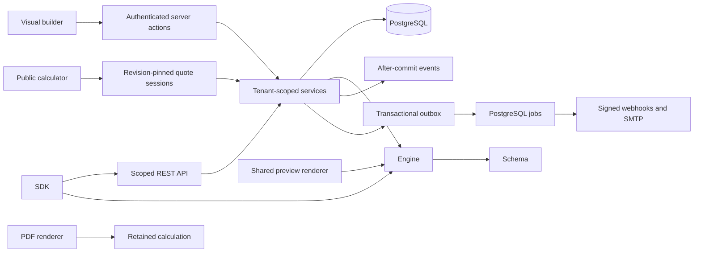

# Architecture

OpenQuoteStack is a modular monolith. Next.js handles HTTP, sessions and UI;
server-only services enforce permissions and orchestrate PostgreSQL transactions.
The portable Schema and deterministic Engine are independent application packages.

Services receive actors from verified sessions. Resource operations check membership,
role and ownership inside serializable transactions. Organization IDs are selectors,
not credentials. Composite foreign keys prevent cross-tenant relationships. UI
permission checks only control presentation.

## Authoring and publication

An estimator has persistent identity, an editable draft and an optimistic draft
version. Validated draft saves do not affect customers. Publishing captures an
immutable snapshot and selects it as the active revision. A matching latest content
hash reuses that snapshot. Rollback explicitly selects a previous revision.

The builder authors portable data: steps, fields, conditions, rules and result
settings. Field sorting supports pointer and keyboard interaction. The preview and
public route share the same calculator component; preview never saves activity.
Formula input becomes a controlled arithmetic AST, never executable JavaScript.
Imports create new estimator identities, preserving existing resources. Exports
contain definitions rather than leads, sessions or organization credentials.

## Customer calculations

A customer opening an active public calculator receives an unguessable session
capability, valid for 24 hours and pinned to its revision. Publication during the
session does not change the customer's questions or prices. Archiving or unpublishing
blocks further submissions. The server calculates the result and commits the
estimate, completion and any pre-result contact atomically. Repeated submissions
return the same estimate. Post-result contact capture uses the same capability.

Estimates retain effective answers, results, currency exponent, engine version and
revision. Detail screens and PDFs display retained results without recalculation.
Statuses and internal activity are mutable; calculation snapshots are immutable.

Analytics count sessions, starts, furthest steps, completions and leads over 30 days.
Step reports are grouped by revision. Value summaries separate currencies and use
integer arithmetic. Sessions represent visits, not unique people; no network
identity is collected. Lists show the latest 200 estimates or leads.

## Presentation and deployment

Organization locale, timezone and currency are separate. Templates materialize
English or Brazilian Portuguese copy on creation. Selecting a currency preserves
example major-unit prices, rounding rates to that currency's exponent; it does not
perform exchange conversion. Imported currencies are preserved. Owners should
review all template prices before publishing. Date-only pricing inputs represent
business calendar dates; display timestamps use the organization's timezone.

Branding is validated organization data. Colors determine readable foregrounds.
Uploads are normalized images stored through local filesystem or S3 adapters; PDF
generation reads the configured adapter without fetching arbitrary logo URLs.
Docker persists PostgreSQL and brand assets in separate volumes. Both need backups.

In-process events run after commit. Audit entries and outbox records commit with
writes. A separate worker claims PostgreSQL jobs using leases and `SKIP LOCKED`;
webhooks and SMTP retry independently of customer submissions. Delivery is at least
once. Consumers deduplicate event IDs. Redis is not required.

The versioned REST API uses hashed, scoped tenant credentials rather than browser
sessions. API submissions retain an idempotency record and immutable result. SDK
HTTP calls never include browser cookies. Integration secrets use authenticated
encryption with a separately backed-up deployment key.

Custom domains require public DNS and a tenant ownership TXT token, with periodic
reverification. Host routing grants public calculator access only. Embeds use
organization frame allowlists and origin/source/channel-checked resize messages.
Builds require neither credentials nor a running database. Web, migration and worker
containers run as non-root users; migrations and workers use production dependencies.
